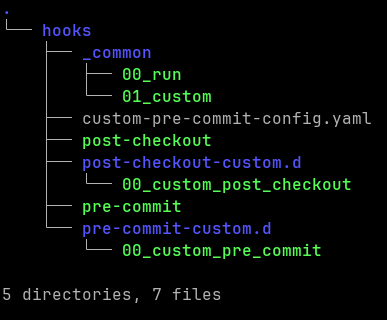

<!-- markdownlint-disable MD013 MD033 MD041 -->
<a id="readme-top"></a>

[![RenovateBot][RenovateBot.icon]][RenovateBot.url]

<!-- PROJECT LOGO -->
<div align="center">
  <h3 align="center">Pre-commit docker</h3>
</div>

<!-- TABLE OF CONTENTS -->
<details>
  <summary>Table of Contents</summary>

- [Inspiration](#inspiration)
- [Description](#description)
  - [Purpose](#purpose)
- [Fundementals](#fundementals)
- [Used techologies](#used-techologies)
- [Getting Started](#getting-started)
  - [Prerequisites](#prerequisites)
  - [Set up](#set-up)
    - [Additional notes](#additional-notes)
    - [Docker image](#docker-image)
- [Usage](#usage)
- [In use](#in-use)
- [Roadmap](#roadmap)
- [Helper](#helper)
- [Contributing](#contributing)
- [License](#license)
- [Contact](#contact)

</details>

Docker image which help you to run pre-commits in a versioned system.

<!-- ABOUT THE PROJECT -->
## Inspiration

This project wouldn't come to alive without the following https://github.com/antonbabenko/pre-commit-terraform repository. The base idea to able to run pre-commit scripts in a docker container was built on that repository's ideas.

Thanks again guys to put so much effort on that work.

## Description

### Purpose

To create a uniformed docker image for pre-commit, to avoid any issues regarding diffferent versions of packages or OS.
Furhtermore, create a solution to handle multiple `.pre-commit-config.yaml` file to meet your company standards and add a possibility to run your very own checks against the code.

## Fundementals

The [docker.args](./docker.args) file contains crutial information regarding softwares and OS settings.

Currently supported packages:

- pre-commit
- checkov
- terraform
- terraform-docs
- terragrunt
- tflint
- ansible-lint
- ansible

The specified version will be installed unless you put `latest` in that case always the latest greatest will be used.
If you set the value to `false`, the package will not be installed.

<p align="right">(<a href="#readme-top">back to top</a>)</p>

## Used techologies

| Icon/Link | Name of the tool |
| --- | --- |
| <a href="https://pre-commit.com/"></a> | **PreCommit** |
| <a href="https://www.checkov.io/"></a> | **Checkov** |
| <a href="https://www.terraform.io/"></a> | **Terraform** |
| <a href="https://terraform-docs.io/"></a> | **Terraform-docs** |
| <a href="https://terragrunt.gruntwork.io/"></a> | **Terragrunt** |
| <a href="https://github.com/terraform-linters/tflint">Terraform-lint</a> | **Terraform-lint** |
| <a href="https://ansible.readthedocs.io/projects/lint/">Ansible-lint</a> | **Ansible-lint** |
| <a href="https://www.ansible.com/"></a> | **Ansible** |

<p align="right">(<a href="#readme-top">back to top</a>)</p>

<!-- GETTING STARTED -->
## Getting Started

This is an example of how you may give set up.

### Prerequisites

| Icon/Link | Name of the tool |
| --- | --- |
| <a href="https://docs.docker.com/engine/install/"></a> | **Docker** |
| <a href="https://git-scm.com/book/en/v2/Getting-Started-Installing-Git"></a> | **Git** |
| <a href="https://pre-commit.com/"></a> | **PreCommit** |

> [!IMPORTANT]
> You must be able to manage docker non-root user.
>
> Follow this guide: [Linux post-installation steps for Docker Engine](https://docs.docker.com/engine/install/linux-postinstall/)

### Set up

To able to use pre-commit templates automatically in every sinlge of newly checked out repository, please follow this guide.

1. Set up the [templateDir](https://git-scm.com/docs/git-init#Documentation/git-init.txt-code--templatecodeemlttemplate-directorygtem) in `~/.gitconfig`. With this everything which lives under `.git-template` directory will be copied to freshly checked out repository.

    <h5 a><strong><code>~/.gitconfig</code></strong></h5>

    ```sh
    ...
    [init]
        templateDir = /home/user/.git-template
    ...
    ```

2. Create the content of `~/.git-template/hooks`. You can choose using the example from `example` directory, in this case you just have to copy-paste the content or use your own solution.



#### Additional notes

You can use multiple `pre-commit-config` file, to validate them against your code. It can be listed in `~/.git-template/hooks/_common/01_custom`.

```sh
# Should be relative to the `git rev-parse --show-toplevel`
run_pre_commit ".git/hooks/custom-pre-commit-config.yaml"
run_pre_commit ".pre-commit-config.yaml"
separator
```

#### Docker image

You can pull docker image locally.

```sh
docker pull ghcr.io/kicsiterence/pre-commit-docker:latest
```

<p align="right">(<a href="#readme-top">back to top</a>)</p>

<!-- USAGE -->
## Usage

Nothing unordanary should be done, just simple follow the git workflow as you did.

<p align="right">(<a href="#readme-top">back to top</a>)</p>

<!-- IN USE -->
## In use


<!-- ROADMAP -->
## Roadmap

- [] Add changelog
- [] Add proper releases

See the [open issues](https://github.com/kicsiterence/pre-commit-docker/issues) for a full list of proposed features (and known issues).

<p align="right">(<a href="#readme-top">back to top</a>)</p>

<!-- HELPER -->
## Helper

To build the images locally you can use `./tools/build.sh`.

```sh
NAME
    local build - Build docker image to test it locally.

OPTIONS
    -n, --name   NAME
        Name of the docker image to build.
        (Defaults to 'master' branch.)

    -t, --tag TAG
        Tag name of the image to build.
        (Defaults to 'latest' branch.)

    -h
        Show this help.
```

<p align="right">(<a href="#readme-top">back to top</a>)</p>

<!-- CONTRIBUTING -->
## Contributing

Contributions are what make the open source community such an amazing place to learn, inspire, and create. Any contributions you make are **greatly appreciated**.

If you have a suggestion that would make this better, please fork the repo and create a pull request. You can also simply open an issue with the tag enhancement**.
Don't forget to give the project a star! Thanks again!

1. Fork the project
2. Create your feature branch
    - `git checkout -b feature/AmazingFeature`
3. Commit your changes
    - `git commit -m 'Add some AmazingFeature'`
4. Push to the branch
    - `git push origin feature/AmazingFeature`
5. Open a Pull Request

<p align="right">(<a href="#readme-top">back to top</a>)</p>

<!-- LICENSE -->
## License

Distributed under the MIT License. See `LICENSE` for more information.

<p align="right">(<a href="#readme-top">back to top</a>)</p>

<!-- CONTACT -->
## Contact

Norbert Finta - [![LinkedIn][Linkedin.icon]][Linkedin.url]

Project Link: [https://github.com/kicsiterence/pre-commit-docker](https://github.com/kicsiterence/pre-commit-docker)

<p align="right">(<a href="#readme-top">back to top</a>)</p>

<!-- MARKDOWN LINKS & IMAGES -->
<!-- https://www.markdownguide.org/basic-syntax/#reference-style-links -->
[Linkedin.icon]: https://img.shields.io/badge/-LinkedIn-black.svg?style=for-the-badge&logo=linkedin&colorB=555
[Linkedin.url]: https://hu.linkedin.com/in/norbert-finta-a7a9b310b
[RenovateBot.icon]: https://img.shields.io/badge/renovate-enabled-brightgreen.svg
[RenovateBot.url]: https://renovatebot.com
